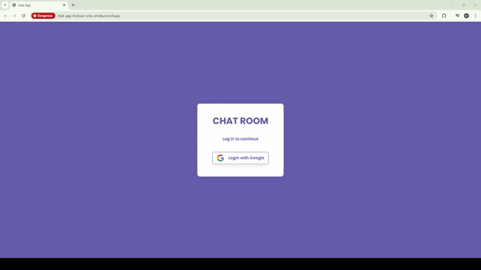

# Simple Chat Application💬✨

This great and funny project was built to learn and reinforce Firebase integration. 

# The project has the following features:

✅ Login & Logout functionality for secure access

✅ Real-time messaging with sender and receiver clearly identified

✅ Room selection to join different chat groups

✅ Usernames displayed in different colors to distinguish participants

✅ Firebase integration using "where" and "sortBy" for efficient data handling

✅ Finally I deployed on Vercel and successfully tested with my friends:))

# Preview of the Project

